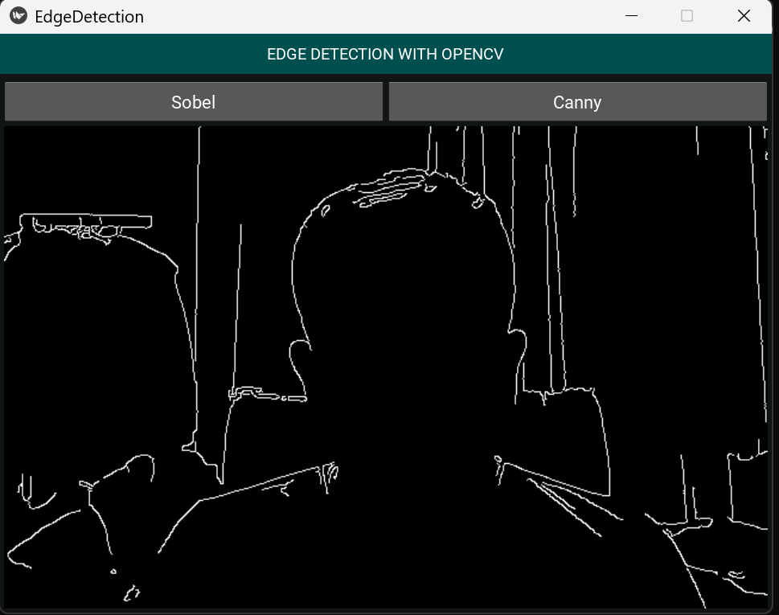
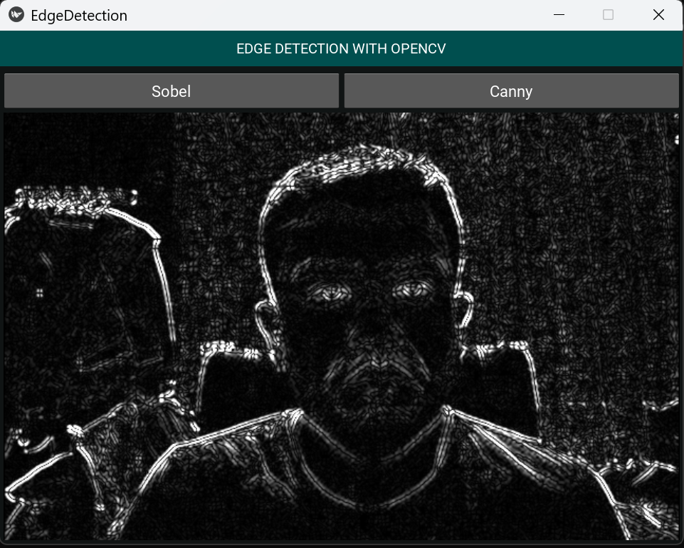

# Project Information

This an example of Opencv working with Kivy as GUI. 

## Features:
- Read and display the web camera view.
- Basic image proccesing (color transformation, filters, edge detection)
- Kivy as GUI Frameworks (layout, text, buttons)
- Observer and singleton pattern for subscription and data sharing across the app.

## Running the project:
### Option 1:
- clone the project and run `pip install -r requirements.txt`, then `python src\main.py`
### Option 2:
- Download "demo.zip"
- Unzip file and run "main.exe"

## Demo images
- Image with Canny edge detection 
    
- Image with Sobel edge detection
    

    